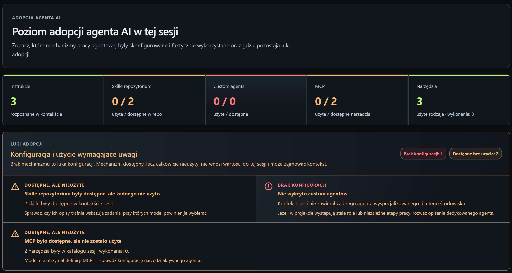
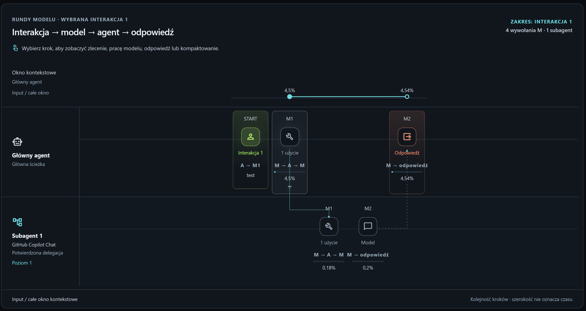
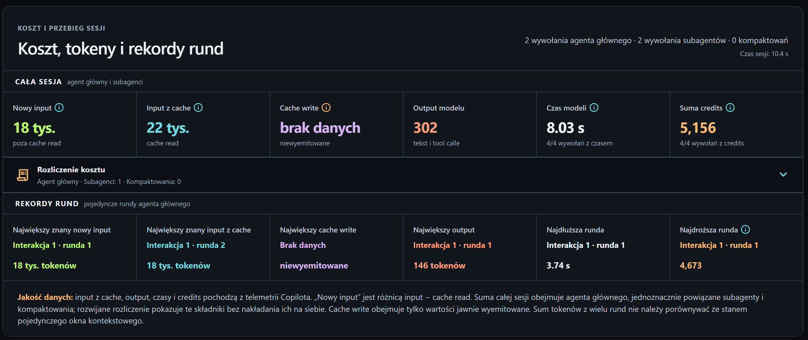
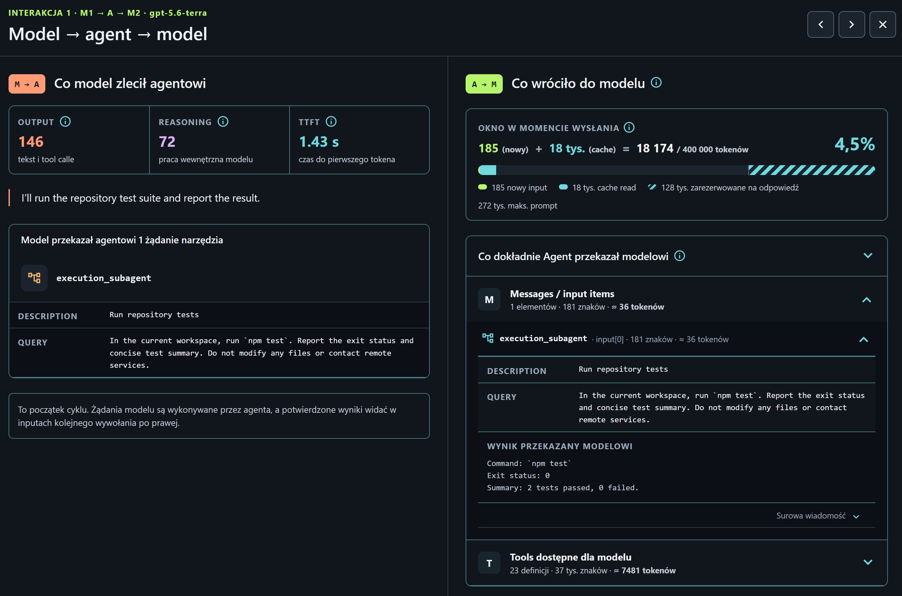
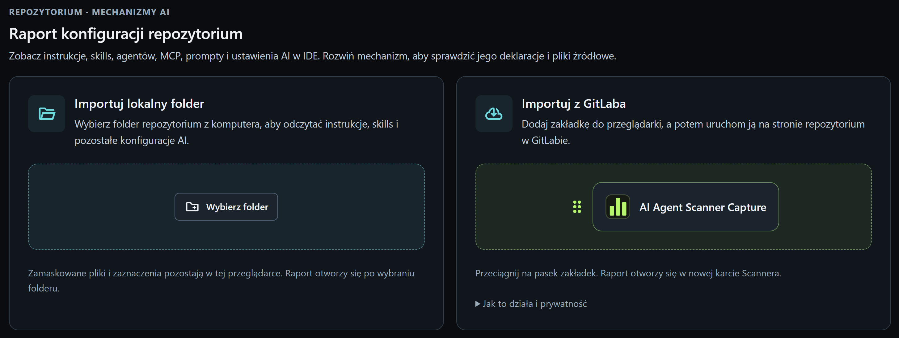
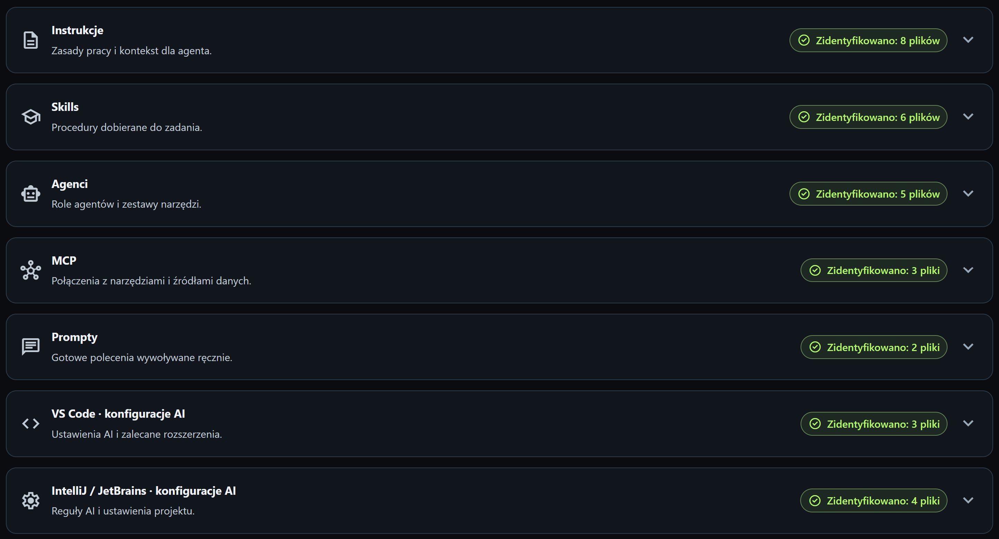

#  Agent Scanner

**Sprawdź, jak agenci AI pracują w Twoim projekcie, co zużywa najwięcej zasobów i gdzie warto wprowadzić usprawnienia.**

[Otwórz demo w przeglądarce](https://mknieszner.github.io/agent-scanner/)

## Do czego służy Agent Scanner

Agent Scanner pomaga zespołom programistycznym ocenić, jak korzystają z agentów AI i co mogą poprawić w codziennej pracy. Łączy analizę **zapisanych sesji GitHub Copilot** z przeglądem **konfiguracji AI w repozytorium**: instrukcji, procedur dla agenta (skills), definicji agentów i narzędzi.

Programiści i liderzy techniczni mogą prześledzić poszczególne kroki pracy, sprawdzić zużycie zasobów i zobaczyć, które narzędzia i procedury są faktycznie używane. Osobom odpowiedzialnym za wdrażanie AI w zespole narzędzie dostarcza danych do oceny konfiguracji, sposobu pracy i potrzeb szkoleniowych.

| Obszar | W czym pomaga | Co można sprawdzić |
|---|---|---|
| **Efektywność pracy** | Znajdowanie powtarzających się czynności i etapów, które zajmują najwięcej czasu. | Kolejne wywołania modelu, użycie narzędzi, zadania przekazane subagentom i czasy wykonania. |
| **Optymalizacja kosztów** | Ustalenie, które operacje zużywają najwięcej zasobów i od czego zacząć optymalizację. | Tokeny wejściowe i wyjściowe, wykorzystanie pamięci podręcznej (cache) oraz GitHub Copilot AI credits. |
| **Bezpieczeństwo** | Przegląd danych udostępnianych modelom i operacji zlecanych agentom. | Zapisane żądania do modelu, parametry i wyniki narzędzi, instrukcje oraz konfigurację MCP. |
| **Standardy pracy** | Przegląd konfiguracji projektu pod kątem zasad przyjętych w zespole i brakujących elementów. | Instrukcje, skills, definicje agentów, MCP, prompty i obsługiwane ustawienia AI w edytorach, wraz z plikami źródłowymi. |
| **Adopcja AI w zespole** | Sprawdzenie, które możliwości agenta są wykorzystywane, a które wymagają lepszej konfiguracji lub wdrożenia do codziennej pracy. | Możliwości dostępne w sesji, przekazane modelowi i faktycznie użyte — w zakresie widocznym w zapisanych danych. |

Scanner pomaga wybrać zmiany, których efekty warto sprawdzić na kolejnych zadaniach. Ich ocenę należy oprzeć zarówno na zużyciu zasobów, jak i jakości wykonanej pracy. Przegląd bezpieczeństwa obejmuje zarejestrowane dane i działania; nie zastępuje audytu podatności ani oceny zgodności.

### Jak wykorzystać wyniki

Zacznij od sesji z typowym zadaniem zespołu. Znajdź krok wymagający poprawy i zmień jeden element: instrukcję, opis procedury, dobór narzędzi lub podział pracy między agentów. Następnie zarejestruj podobne zadanie i porównaj przebieg, zużycie zasobów oraz jakość rezultatu. W ten sposób łatwiej ocenić, czy zmiana przyniosła korzyść.

## Analiza w przeglądarce

Demo odczytuje **pliki sesji GitHub Copilot w formacie OpenTelemetry** i wybrane pliki konfiguracji AI repozytorium. Sesje można przeglądać w podsumowaniu, na osi czasu i na mapie pracy agenta.

Przetwarzanie odbywa się w przeglądarce. Do korzystania z demo nie trzeba uruchamiać serwera ani podawać klucza API do modelu AI. Interfejs aplikacji jest po polsku.

*Podsumowanie wskazuje użyte możliwości agenta oraz elementy konfiguracji wymagające uwagi.*

## Analiza sesji agenta

### Przebieg pracy i zużycie zasobów

**Mapa pracy** pokazuje kolejne wywołania modelu (rundy), użycie narzędzi i zadania przekazane subagentom. Uwzględnia także kompaktowanie, czyli skracanie kontekstu rozmowy przez podsumowanie wcześniejszej treści. Można przełączać widoki kontekstu, tokenów i credits, wybrać interakcję z użytkownikiem i otworzyć szczegóły rundy.

*Mapa pokazuje podział pracy między głównego agenta a subagenta oraz kolejność wywołań modeli.*

Widok **Koszt i przebieg** łączy zestawienie zużycia z osią czasu. Pokazuje osobno wywołania głównego agenta, powiązanych subagentów i kompaktowania. Suma sesji nie uwzględnia tych samych wywołań dwukrotnie. Czas pracy modeli jest prezentowany oddzielnie od czasu trwania całej sesji.

*Zestawienie wyróżnia rundy o największym zużyciu i najdłuższym czasie wykonania.*

### Kontekst i narzędzia

W szczegółach rundy można przejrzeć zapisane instrukcje i wiadomości, żądania wysłane do modelu, jego odpowiedzi oraz parametry i wyniki narzędzi. Dla kompaktowania dostępne są żądanie i wygenerowane podsumowanie. Porównanie kontekstu przed skróceniem i po nim pojawia się wtedy, gdy późniejsze dane potwierdzają, że model otrzymał podsumowanie.

Zestawienie narzędzi rozróżnia ich dostępność i użycie. Pozwala przeglądać wersje definicji oraz znaleźć wywołania z tymi samymi wartościami parametrów. Wskazuje też rundy, w których wystąpiły. Ułatwia to ocenę, ile miejsca zajmują definicje narzędzi w kontekście i czy agent powtarza tę samą pracę. Samo powtórzenie nie musi oznaczać błędu.

*Po lewej: zadanie zlecone subagentowi. Po prawej: wynik testów przekazany do kolejnej rundy oraz informacje o kontekście modelu.*

### Wykorzystanie możliwości agenta

**Podsumowanie** pokazuje, które instrukcje repozytorium, skills, definicje agentów i narzędzia MCP znalazły się w zapisie sesji. Uwzględnia również pracę subagentów i kompaktowanie. Rozróżnia elementy dostępne w sesji, przekazane modelowi oraz użyte podczas pracy. Jeśli zapis jest niepełny, brak danych pozostaje widoczny — nie jest uznawany za dowód, że dana możliwość była niedostępna.

Zakładka **Dane techniczne** udostępnia przeszukiwalną listę spanów, czyli zapisów operacji w telemetrii, wraz z ich atrybutami i danymi źródłowymi. Pozwala sprawdzić, na jakich informacjach opiera się analiza.

## Przegląd konfiguracji repozytorium

Możesz wybrać folder repozytorium z komputera lub zaimportować konfigurację z GitLaba. W drugim przypadku przeciągnij **AI Agent Scanner Capture** na pasek zakładek przeglądarki, a następnie uruchom tę zakładkę na stronie repozytorium. Zawarty w niej skrypt odczyta wybrane pliki konfiguracji, korzystając z Twojej sesji w GitLabie, i przekaże je do Scannera.

*Konfigurację można wczytać z komputera lub bezpośrednio z GitLaba.*

Raport pozwala:

- Przeglądać instrukcje, skills, definicje agentów, MCP, prompty oraz obsługiwane ustawienia AI w VS Code i środowiskach JetBrains.
- Otwierać podgląd zapisanych plików i przechodzić do źródeł, jeśli dostępne są informacje o repozytorium potrzebne do utworzenia linku.
- Zapisać migawkę konfiguracji i wrócić do niej później.
- Pobrać PDF z informacjami o repozytorium, podziałem na kategorie, szczegółami konfiguracji, fragmentami plików i odnośnikami.

Scanner pokazuje także odnośniki z konfiguracji do innych plików, ale nie pobiera dodatkowo ich treści. Zakres raportu obejmuje wybrane konfiguracje AI, a nie przegląd całego kodu. Ustawienia bezpieczeństwa przeglądarki lub GitLaba mogą ograniczyć działanie zakładki importującej.

*Raport porządkuje konfigurację według kategorii. Dane z sesji pozwalają później sprawdzić, które z tych elementów zostały użyte.*

## Pierwsza analiza sesji

1. [Otwórz Agent Scanner](https://mknieszner.github.io/agent-scanner/).
2. Skopiuj konfigurację zapisu telemetrii ze strony startowej do ustawień użytkownika VS Code w formacie JSON (**User Settings (JSON)**). Ustaw ścieżkę pliku w `github.copilot.chat.otel.outfile`, przeładuj okno VS Code i wykonaj zadanie z Copilotem.
3. W Scannerze wybierz **Wczytaj plik Copilot OTel JSONL** lub ikonę importu przy nagłówku **Sesje**. Wskaż utworzony plik `.jsonl` albo `.ndjson` o rozmiarze do **64 MiB**.
4. Sprawdź podgląd, zaznacz rozmowy do importu i zatwierdź wybór. Scanner dołączy subagentów i wywołania pomocnicze, które można jednoznacznie powiązać z wybranymi rozmowami.
5. Otwórz **Podsumowanie**, **Koszt i przebieg**, **Mapę pracy** i **Dane techniczne**.

Zakres szczegółów zależy od ustawień zapisu telemetrii. Rejestrowanie treści może obejmować kod, polecenia użytkownika i wyniki narzędzi, dlatego włącz je dla materiału, który chcesz zapisać.

Importer obsługuje pliki **Copilot OTel JSONL**; pozostałe formaty OTLP nie są obsługiwane. Eksport dostępny w Scannerze zapisuje sesję we własnym formacie JSON, przeznaczonym do przeglądania i udostępniania. Nie można go ponownie wczytać importerem sesji. Do ponownego importu zachowaj oryginalny plik JSONL z Copilota.

## Demo w przeglądarce a pełna aplikacja

| Funkcja | Publiczne demo w przeglądarce | Pełna aplikacja |
|---|---|---|
| Import plików sesji, oś czasu, mapa pracy, narzędzia i surowe dane | Dostępne lokalnie | Dostępne |
| Przegląd konfiguracji repozytorium, import z folderu lub GitLaba i raport PDF | Dostępne lokalnie | Dostępne |
| Przechowywanie danych | Lokalna baza przeglądarki (IndexedDB) | Lokalna baza aplikacji |
| Odbieranie telemetrii przez OTLP/HTTP | Niedostępne | Dostępne po skonfigurowaniu serwera aplikacji |
| AI Hub: klasyfikacja działań, rozmowa o sesji i zalecenia optymalizacyjne | Niedostępne | Uruchamiane przez użytkownika po skonfigurowaniu integracji z Copilotem |
| Ocena konfiguracji repozytorium przez AI | Niedostępna | Uruchamiana przez użytkownika po wyborze danych i modelu |

Demo analizuje zapisane dane bez wywoływania modeli AI. W pełnej aplikacji dodatkowe analizy AI uruchamia użytkownik; mogą one przekazywać wybrane dane do Copilota. To repozytorium udostępnia demo, bez kodu źródłowego i pakietu instalacyjnego pełnej wersji.

## Jak czytać wyniki

- **Pomiary są odróżniane od wyliczeń i szacunków.** Symbol `≈` oznacza wartość szacunkową. Brak pomiaru nie jest traktowany jak zero; podział tokenów między części treści nie jest dokładnym zliczeniem.
- **Credits oznaczają GitHub Copilot AI credits.** Nie są kwotą w walucie, a zestawienie w Scannerze nie zastępuje rozliczenia dostawcy.
- **Analiza obejmuje zapisane dane.** Scanner nie odtwarza brakujących wiadomości ani wewnętrznego rozumowania modelu, którego nie zapisano w telemetrii.
- **Dostępność, zlecenie i wykonanie to różne informacje.** Samo udostępnienie narzędzia nie oznacza jego użycia, a żądanie wykonania nie potwierdza sukcesu. Demo pokazuje zaimportowany zapis sesji, bez połączenia na żywo z edytorem.

## Dane i prywatność

W demo odczyt i analiza plików odbywają się lokalnie w przeglądarce, a dane są zapisywane w jej bazie IndexedDB. Wczytane sesje i pliki repozytorium nie są wysyłane na serwer Scannera ani do usługi AI. Połączenie z siecią jest potrzebne do pobrania aplikacji z GitHub Pages oraz do importu z GitLaba, który korzysta z Twojej aktywnej sesji w tej usłudze.

Dostęp do zapisanych danych zależy od adresu witryny i profilu przeglądarki. Wyczyszczenie danych witryny, automatyczne zwolnienie miejsca przez przeglądarkę lub zmiana profilu może spowodować utratę dostępu do zapisanych sesji. Sesje i migawki konfiguracji można też usuwać w aplikacji.

Pliki telemetrii i eksporty mogą zawierać kod, polecenia użytkownika, ścieżki plików oraz parametry i wyniki narzędzi. Scanner maskuje rozpoznane sekrety w konfiguracji repozytorium, ale nie zapewnia pełnej anonimizacji. Przed udostępnieniem sprawdź zawartość pliku JSON, raportu PDF lub zrzutu ekranu.

## O tym repozytorium

To **publiczne repozytorium demo** Agent Scanner. Gałąź `gh-pages` zawiera pliki aplikacji, ten opis i zrzuty ekranu. Kod źródłowy jest rozwijany w osobnym, prywatnym repozytorium.

[Uruchom Agent Scanner](https://mknieszner.github.io/agent-scanner/)
